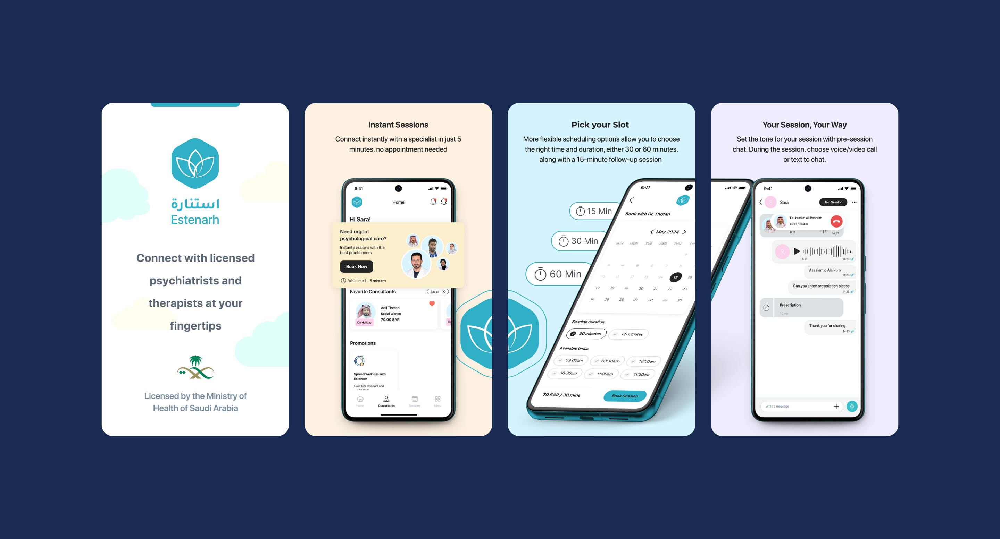

# Dawood Shahid Portfolio

Welcome to my portfolio! I'm a Software Engineer focused on building robust, scalable, and impactful digital products. Here, I highlight my professional experience, featured projects, and ways you can get in touch with me.

🌐 [View My Live Portfolio](https://dawood-shahid-portfolio.vercel.app/)

---

## Table of Contents

- [About](#about)
- [Features](#features)
- [Screenshots](#screenshots)
- [Featured Projects](#featured-projects)
- [Tech Stack](#tech-stack)
- [Getting Started](#getting-started)
- [Available Scripts](#available-scripts)
- [Contact](#contact)

---

## About

This is my personal portfolio website. I use it to showcase my professional background, key projects, and provide a way for you to download my resume or contact me. I built this portfolio using modern web technologies for optimal performance and aesthetics.

---

## Features

- **Modern UI**: Responsive, accessible design with smooth transitions and animations.
- **About Section**: Brief professional introduction and dynamic animated text about me.
- **Experience**: Overview of my relevant work experience.
- **Featured Projects**: Interactive grid of my selected projects, each with descriptions, tech stack, and links.
- **Contact**: Multiple ways to reach me and a button to view/download my resume.
- **Built With**: React, Next.js (App Router), Tailwind CSS, TypeScript, Framer Motion.

---

## Screenshots

| Home / About                           | Projects                                    |
| -------------------------------------- | ------------------------------------------- |
|  |  |

---

## Featured Projects

### 1. Estenarh — Online Therapy App

- **Description**: A licensed mental health app (MOH approved) offering private and affordable therapy with certified psychologists. Features secure chat, voice/video calls, instant booking, and flexible payment options.
- **Tech Stack**: React Native, RTK, HyperPay, Tabby, AppsFlyer, Fastlane
- **Links**: [Play Store](https://play.google.com/store/apps/details?id=com.estenarh.app) | [App Store](https://apps.apple.com/us/app/estenarh-online-therapy-app/id1529172019)

### 2. Estenarh Consultant — For Healthcare Practitioners

- **Description**: A platform for therapists to manage schedules, accept session requests, and connect with patients via chat, voice, or video. Includes 24/7 technical support.
- **Tech Stack**: React Native, React Native Reanimated 2, Socket.IO, Zoom, OneSignal
- **Links**: [Play Store](https://play.google.com/store/apps/details?id=com.consultant.estenarh.app) | [App Store](https://apps.apple.com/us/app/estenarh-consultant-app/id1663499493)

### 3. Pure CSS Loaders Extended (Open Source)

- **Description**: A collection of customizable loading animations built entirely with CSS. Lightweight, responsive, and no JavaScript required.
- **Tech Stack**: React, TypeScript, Bootstrap
- **Links**: [GitHub](https://github.com/iomechs/pure-css-loaders-extended) | [Live Demo](https://pure-css-loaders-extended.netlify.app/#/)

### 4. Career Connect — Counselling & Education App

- **Description**: I built this app to provide career guidance and educational support for individuals of all age groups.
- **Tech Stack**: React Native, Native Base, Reanimated, Redux, Redux Most
- **Links**: [Play Store](https://play.google.com/store/apps/details?id=club.careerconnect.app&hl=en&gl=US)

---

## Tech Stack

- **Frontend**: React, Next.js (App Router)
- **Styling**: Tailwind CSS, Custom CSS Variables, Framer Motion
- **Type Checking**: TypeScript
- **UI Components**: Embla Carousel, Lucide React

---

## Getting Started

### Prerequisites

- Node.js (>=18.x recommended)
- npm or yarn

### Installation

1. **Clone the repository**

   ```bash
   git clone https://github.com/Dawood-Shahid/Portfolio.git
   cd Portfolio
   ```

2. **Install dependencies**

   ```bash
   npm install
   # or
   yarn install
   ```

3. **Run the development server**

   ```bash
   npm run dev
   # or
   yarn dev
   ```

4. Open [http://localhost:3000](http://localhost:3000) in your browser.

---

## Available Scripts

- `dev` — Runs the app in development mode.
- `build` — Builds the app for production.
- `start` — Runs the built app in production mode.
- `lint` — Lints the codebase.

---

## Folder Structure

```
/app                # Next.js app directory (App Router)
/components         # My UI components and sections (about, projects, contact, etc.)
/public             # Static files (images, profile.png, etc.)
/styles             # Global styles and Tailwind config
```

---

## Contact

- Portfolio: [dawood-shahid-portfolio.vercel.app](https://dawood-shahid-portfolio.vercel.app/)
- Email: You can find my email in the contact section of this site
- Download Resume: Available directly in the navigation and contact section

---

© 2025 Dawood Shahid. Built with ❤️ using React, Next.js & Tailwind CSS.
